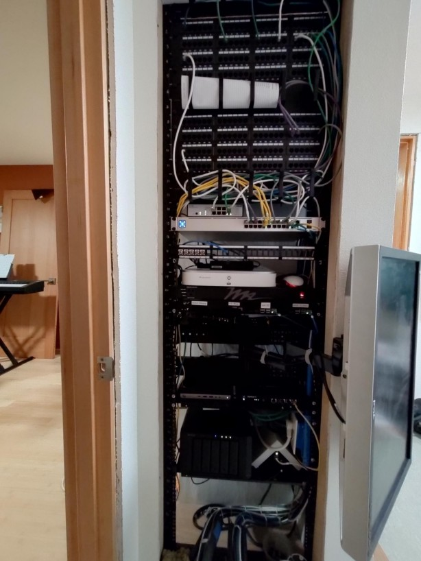
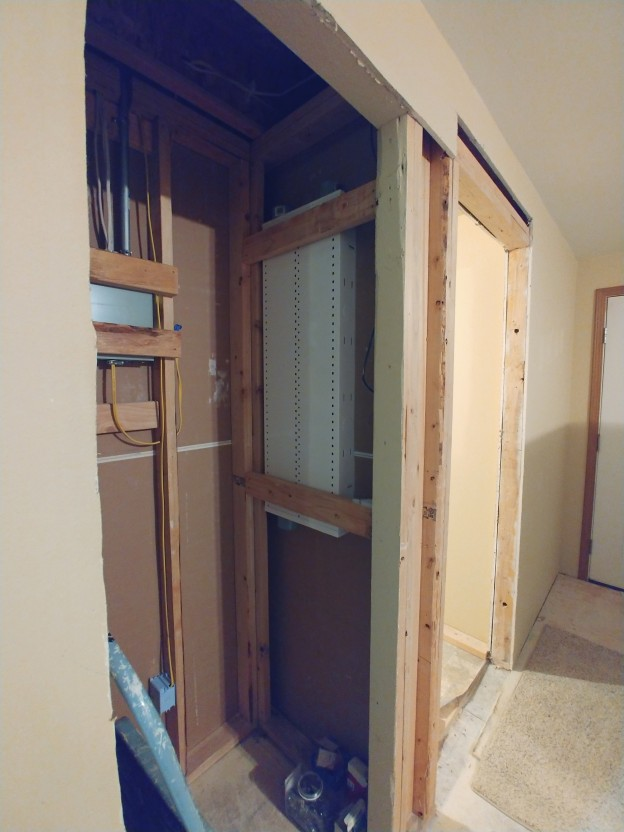

# Leviathan: Homelab 2022
Cameron R. Cumberland (cameron.r.cn@gmail.com)

## Stats
+ 4,000 feet of Cat-5e cable
+ 98 ethernet drops in a house &mdash; done 'by hand'
    + across 4 'bedrooms'
    + LAN cameras
    + media room & dining room
+ 30+ devices

## Control Rack

### Guide (top to bottom of image)

|Hardware | Running | For |Note|
|---|---|---|---|
| 96-port patch panel (x2) | - | routing from house (2 storey) | Ports around the house are labeled to match with the panel|
| Ubiquiti PoE+ 8-port router | - | powers PoE hubs @ home desks (x3) ||
| Ubiquiti 24-port switch | - | Routes rack-side managment ||
| Coax (x5) | - | TV or satellite to all 3 bedrooms, 2 main rooms ||
| Lexar | Camera manager | manager for external security webcams||
| Raspberry Pi4 (x4)|-|PiHole DNS server Ubiquiti management console Camera management Kodi media server||
| HP ProDesk 600 | openSUSE Leap 15.3 (headless), `ssh` managed | Minecraft server |emails out external LAN IP to friend mailing list|
| Helm server | Helm email service | self-hosted encrypted email ||
| Synology 20TB NAS | Synology | media hosting, laptop backups||
| Ancient Dell Monitor | connected to management consoles |direct CLI management of machines|||

&nbsp;

### About

+ Network machines (x2, Minecraft and Media player) both run openSUSE Leap 15.x
+ Personal laptops and desktops (x5) run openSUSE Tumbleweed
+ Separate WiFi for guests

Been wholly on openSUSE for 3 years now!

&nbsp;

## Origins
The house was gutted in mid-2019, with rennovation affecting 100% of rooms. While the walls were out, why not run ethernet to every room? Make the ultimate network, a mini-enterprise version. 

The benefits, aside from the cool factor, are a more reliable home intranet (for streaming movies internally), better security, and better network management.

The initial cabinet proved far too small, once all the cables were run!

## Physical
The entire house is wired with Cat 5e type B, "hand built!"

Punching in the cables:

Data lines running through the attic:

## TODO
+ Make a more comprehensive writeup of the homesystem
+ Further develop VLANs for external access to Minecraft server
+ Host media library (music) centrally for in-home streaming
+ Self-host GitLab w/ external access